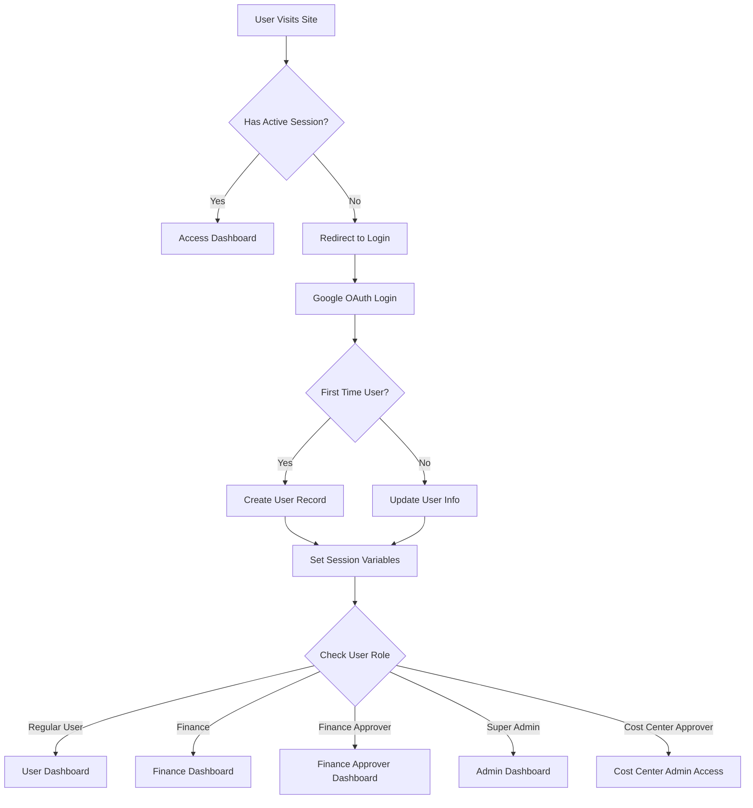
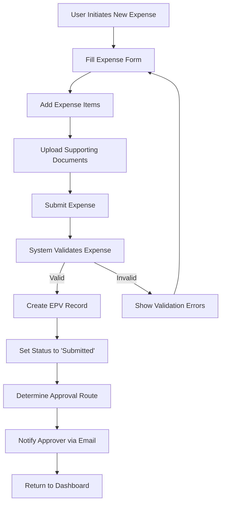
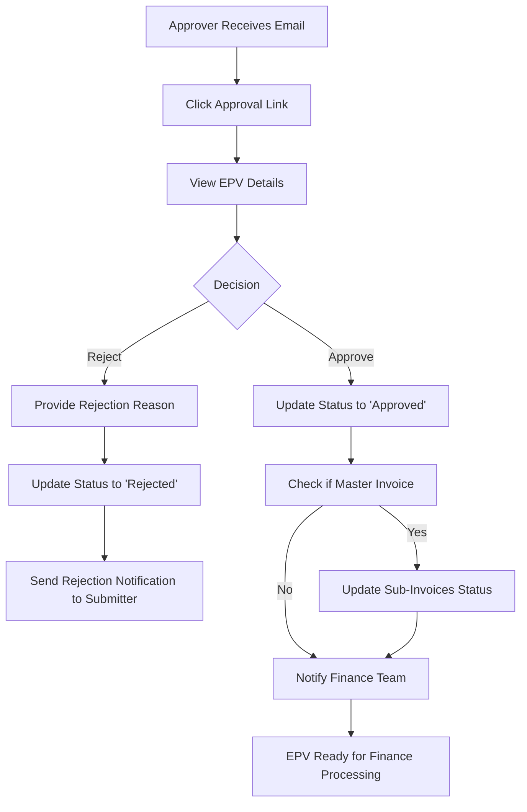
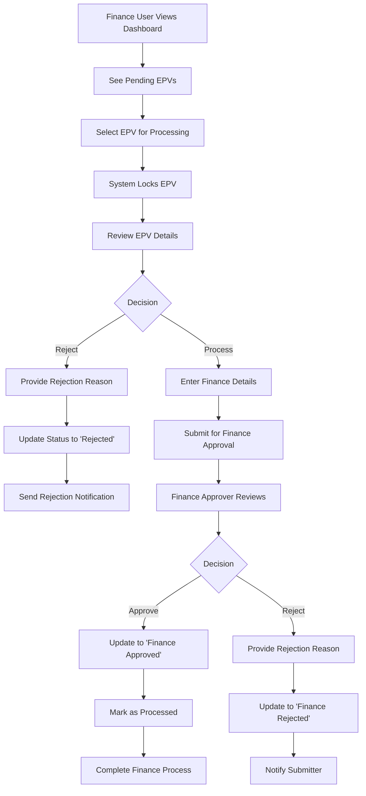
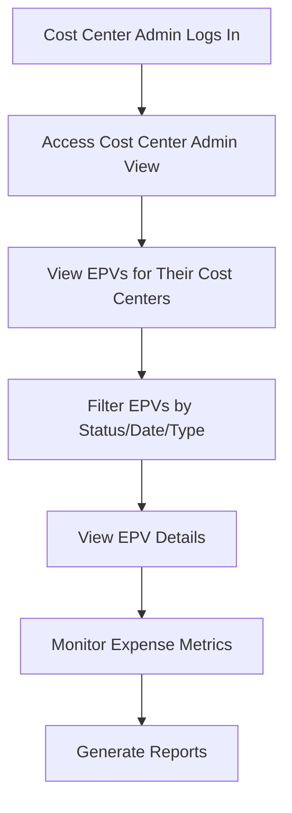
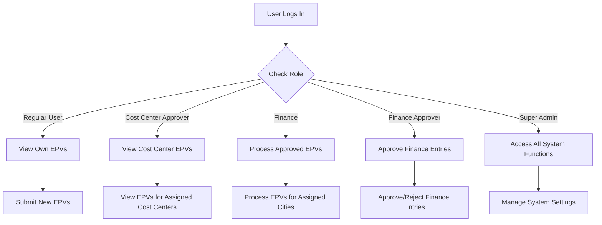
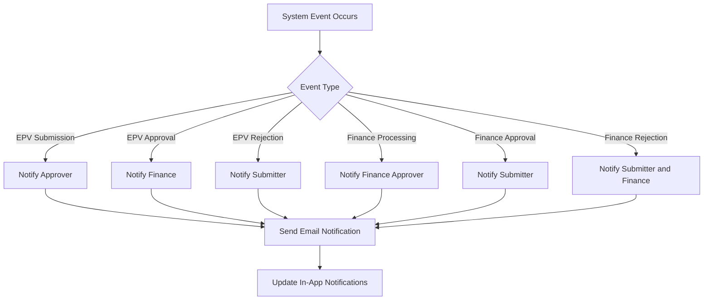
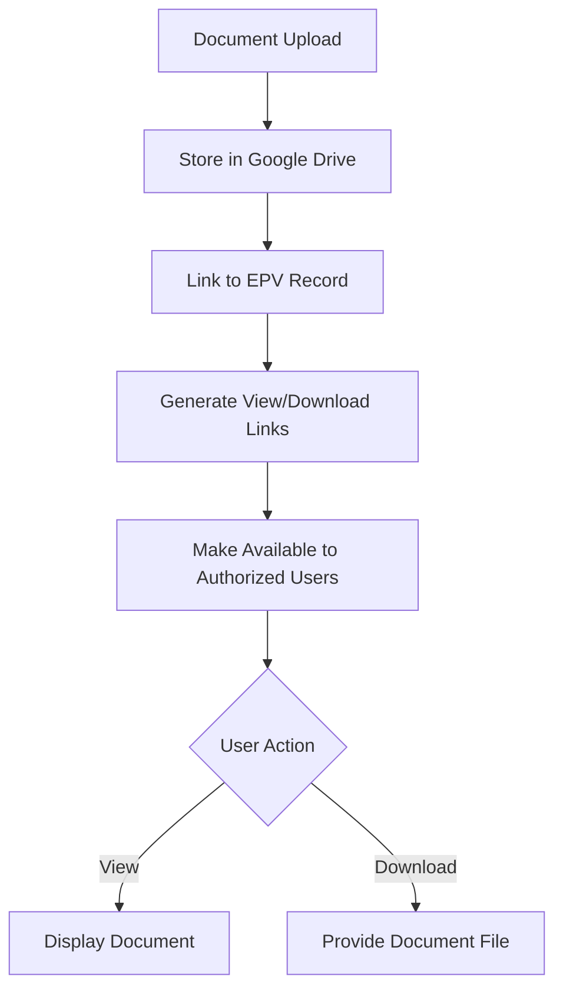

# Expense Processing Voucher (EPV) System Flow Chart

## Overview

This document provides a visual representation of the key workflows in the EPV system, including:

1. User Authentication Flow
2. Expense Submission Process
3. Approval Workflow
4. Finance Processing Flow
5. Cost Center Administration

## 1. User Authentication Flow

## 2. Expense Submission Process

## 3. Approval Workflow

## 4. Finance Processing Flow

## 5. Cost Center Administration

## 6. User Role Access Control

## 7. Notification System

## 8. Document Management

## Conclusion

This flow chart provides a high-level overview of the key processes in the EPV system. The actual implementation may contain additional details and edge cases not captured in these diagrams.
