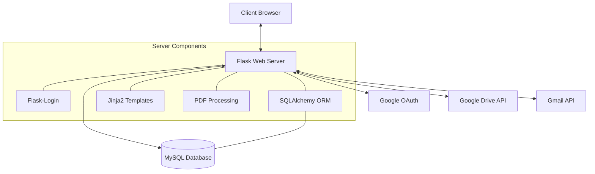
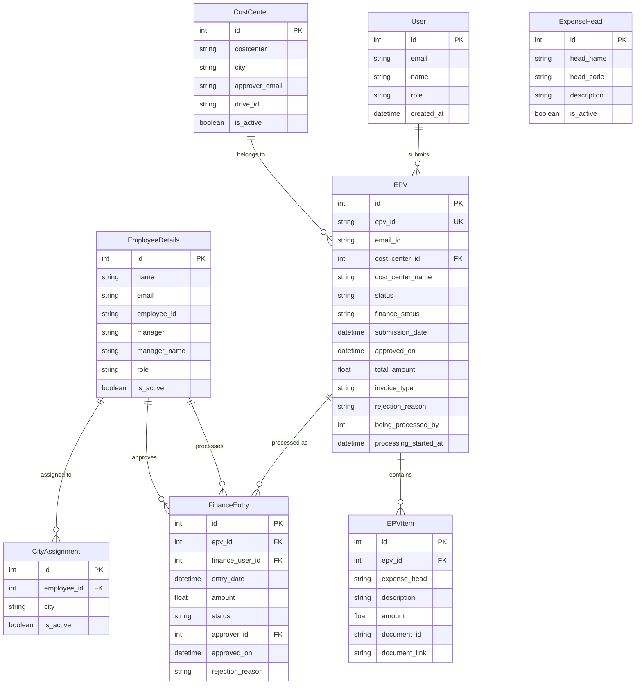
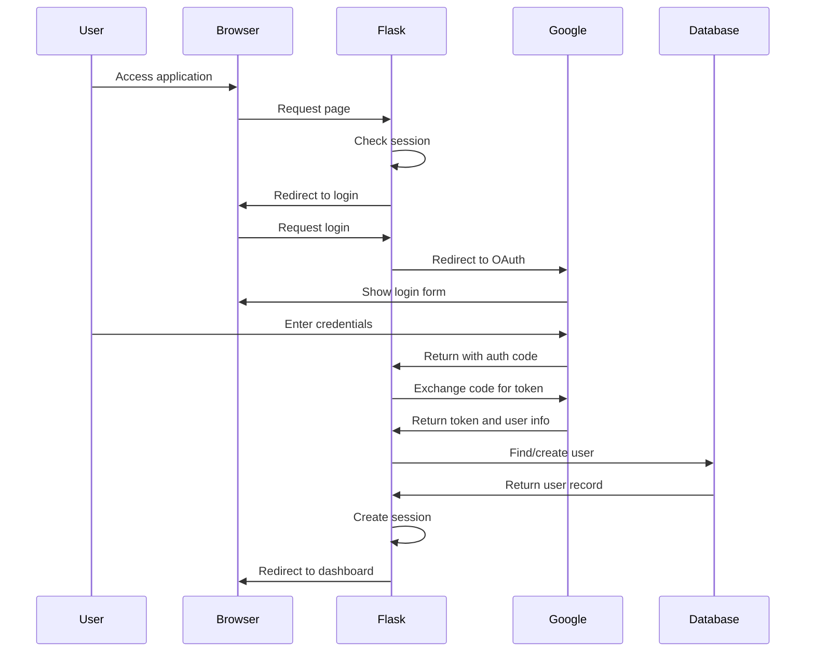
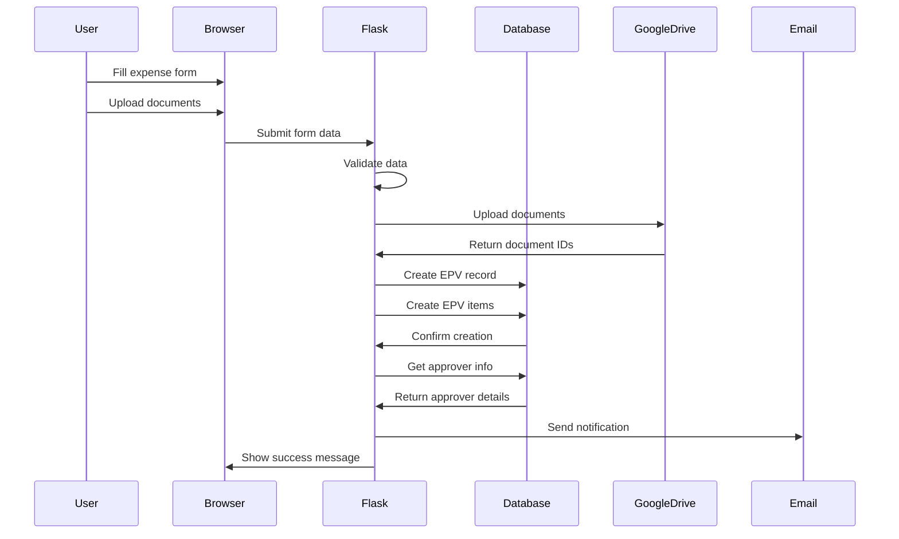
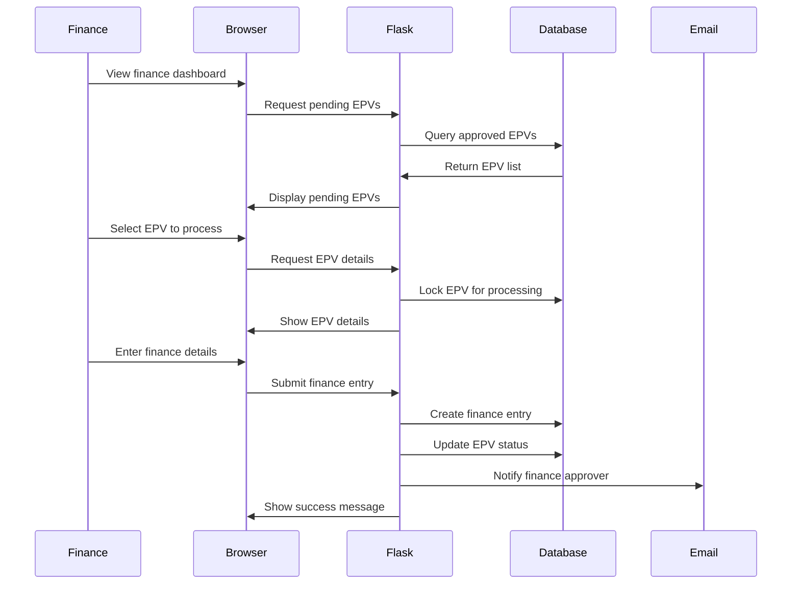
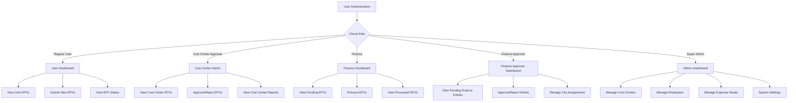
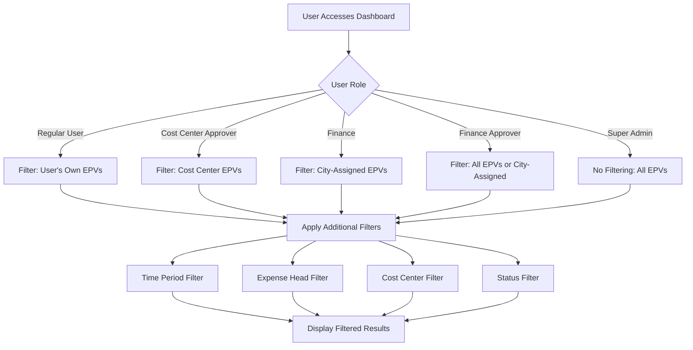
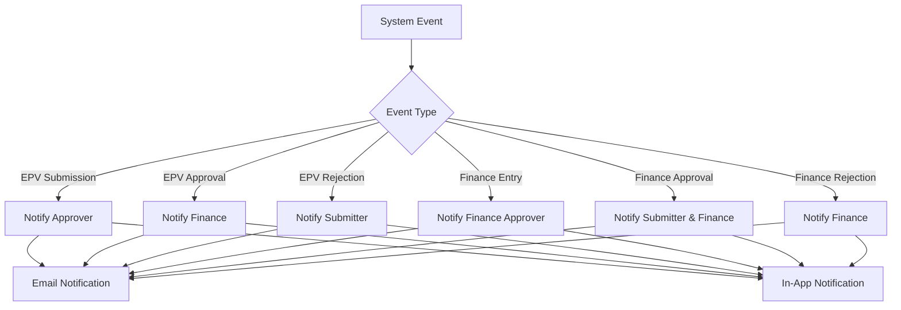
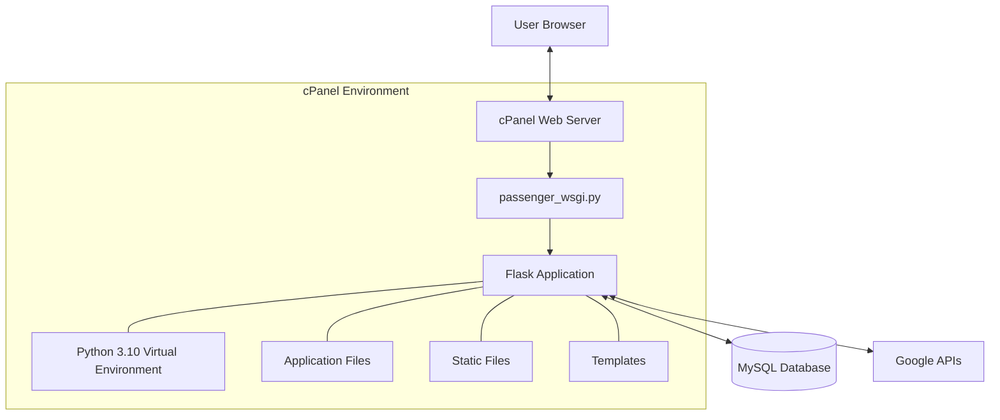

# EPV System Technical Architecture

## System Architecture Overview

## Database Schema

## Authentication Flow

## Expense Submission Flow

## Finance Processing Flow

## Role-Based Access Control

## Data Filtering Logic

## Notification System

## Deployment Architecture

