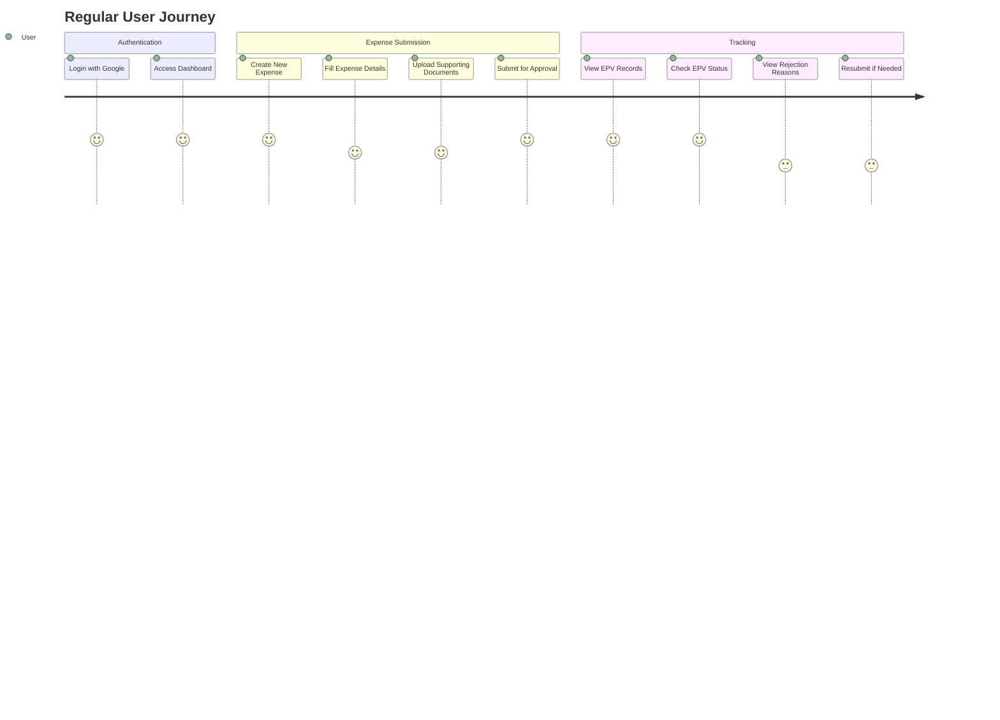
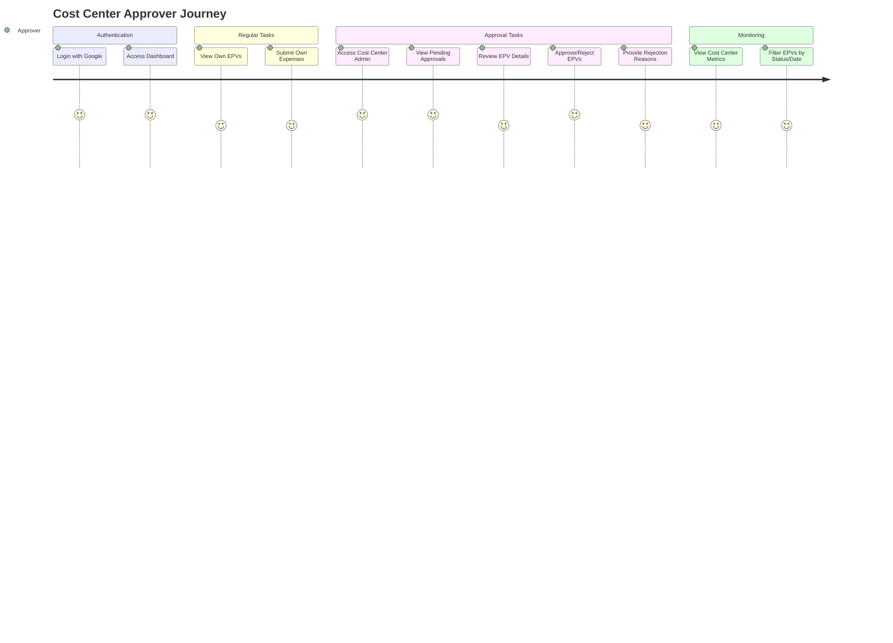
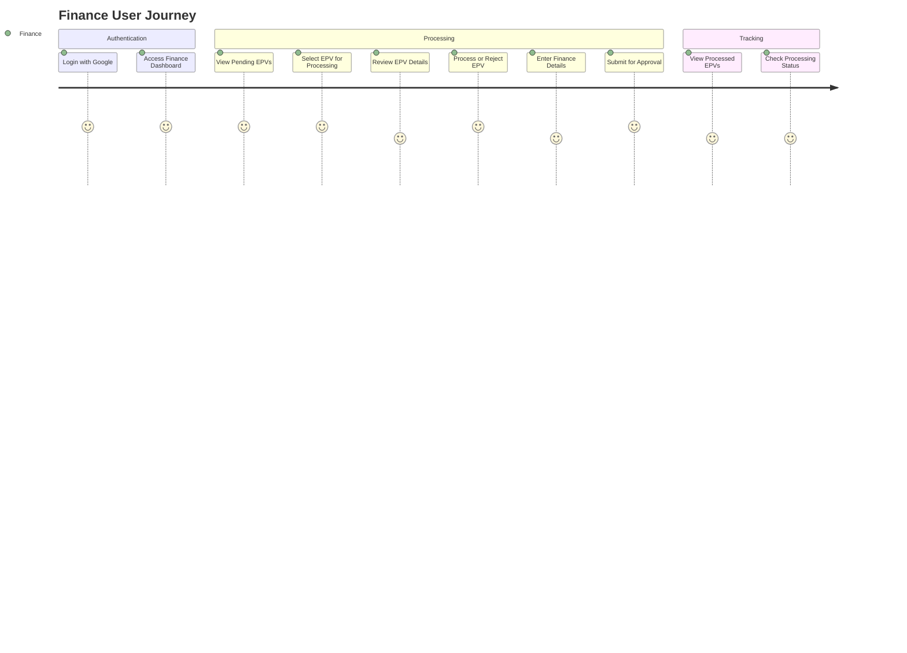
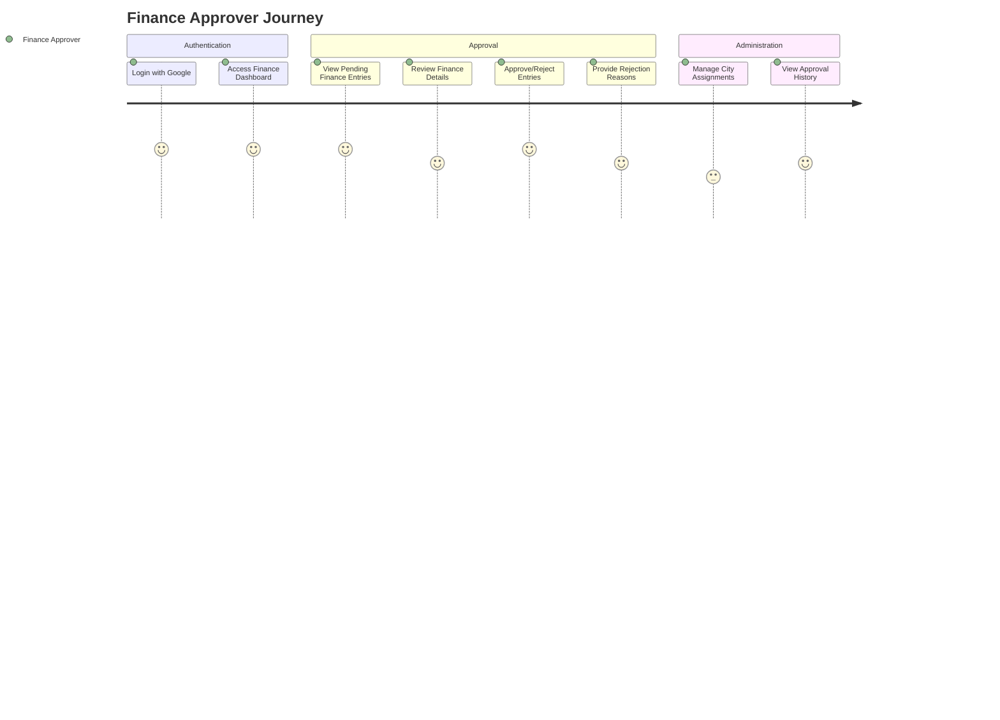
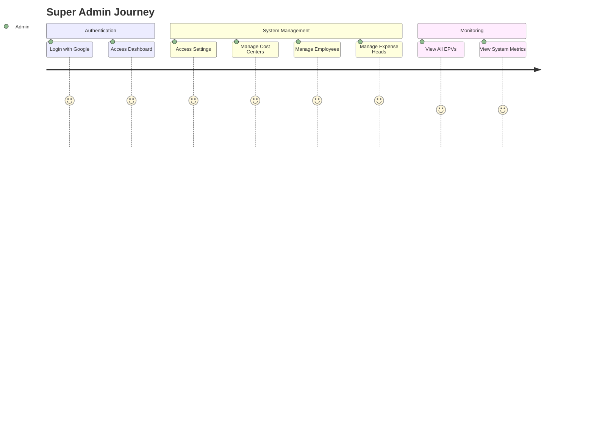
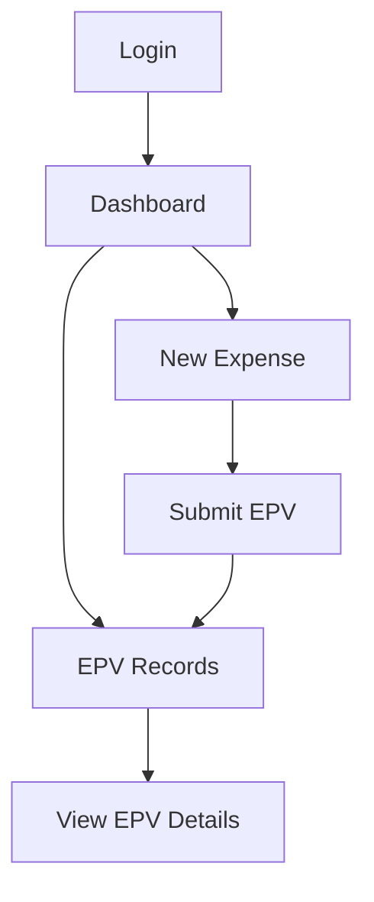
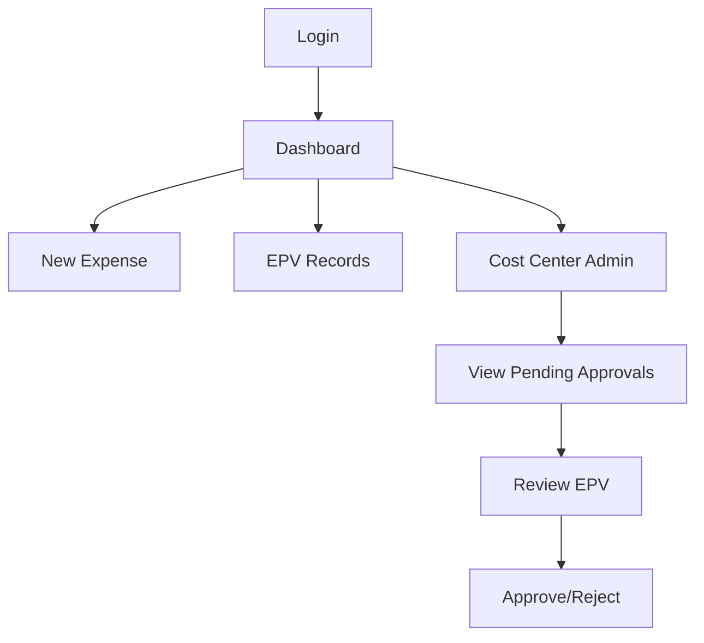
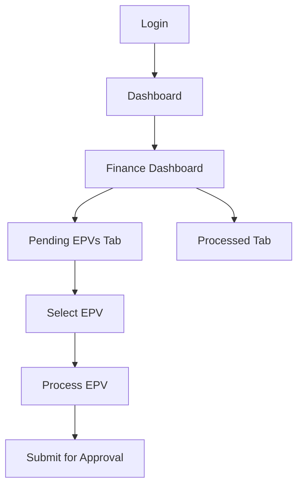
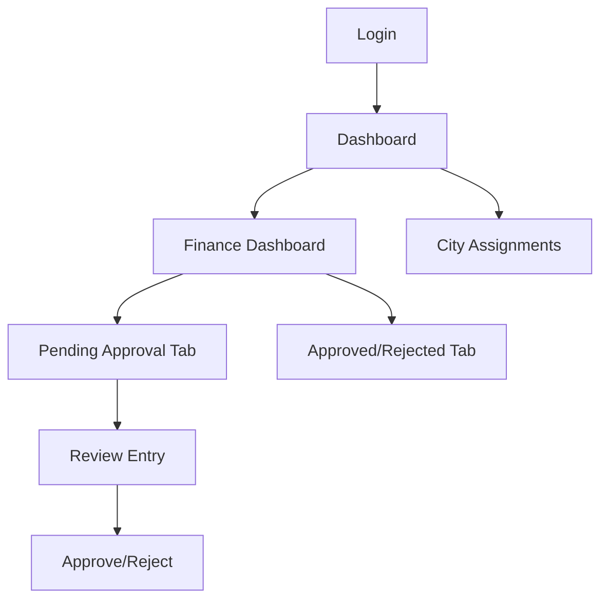
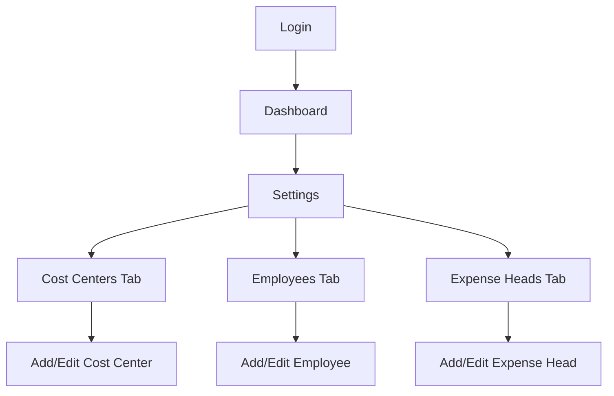

# EPV System User Journeys

This document outlines the different user journeys through the EPV (Expense Processing Voucher) system based on user roles.

## 1. Regular User Journey

### Regular User Access Permissions:
- Can create and submit new expense vouchers
- Can view their own submitted EPVs
- Can see only cost centers they've submitted EPVs for in the dashboard filters
- Can track the status of their submissions
- Can view rejection reasons if an EPV is rejected
- Can resubmit rejected EPVs with corrections

## 2. Cost Center Approver Journey

### Cost Center Approver Access Permissions:
- Has all regular user permissions
- Can access the Cost Center Admin section
- Can view all EPVs submitted for their assigned cost centers
- Can approve or reject EPVs for their cost centers
- Can provide rejection reasons when declining an EPV
- Can view cost center expense metrics and reports
- Can see only cost centers they're approvers for in the dashboard filters

## 3. Finance User Journey

### Finance User Access Permissions:
- Can access the Finance Dashboard
- Can view approved EPVs pending finance processing
- Can process EPVs by entering finance details
- Can reject EPVs with reasons if issues are found
- Can submit processed EPVs for finance approval
- Can view all cost centers in the dashboard filters
- Can only see EPVs for their assigned cities

## 4. Finance Approver Journey

### Finance Approver Access Permissions:
- Can access the Finance Dashboard with approver view
- Can view finance entries pending approval
- Can approve or reject finance entries
- Can provide rejection reasons when declining entries
- Can manage city assignments for finance personnel
- Can view approval history and metrics
- Can view all cost centers in the dashboard filters

## 5. Super Admin Journey

### Super Admin Access Permissions:
- Has access to all system functions
- Can manage cost centers (add, edit, deactivate)
- Can manage employees (add, edit, assign roles)
- Can manage expense heads (add, edit, deactivate)
- Can view all EPVs in the system regardless of status
- Can access system settings and configuration
- Can view all cost centers in the dashboard filters

## User Interface Navigation Flows

### 1. Regular User Navigation

### 2. Cost Center Approver Navigation

### 3. Finance User Navigation

### 4. Finance Approver Navigation

### 5. Super Admin Navigation

## Mobile Experience

The EPV system is responsive and provides a mobile-optimized experience with:

- Mobile-friendly forms for expense submission
- Bottom navigation bar for easy access to key functions
- Collapsible admin menu to maintain consistent navbar height
- Touch-friendly UI elements for approval/rejection actions
- Optimized document viewing on mobile devices
